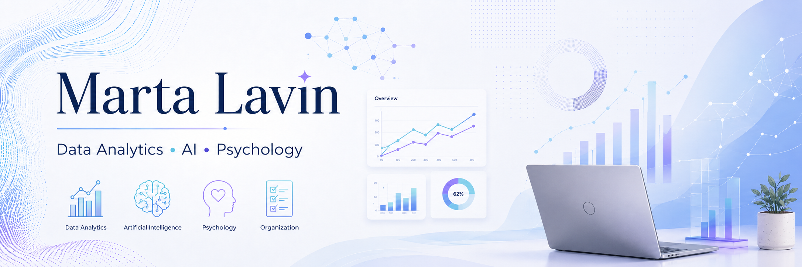

# Hola, soy Marta 👋

Soy estudiante de Psicología y me estoy formando en análisis de datos, inteligencia artificial, secretariado médico y asistencia virtual.

Me interesa unir datos, tecnología y enfoque humano para crear soluciones útiles, organizadas y fáciles de entender.

## Áreas que estoy desarrollando

- Data Analytics
- Inteligencia Artificial aplicada
- Psicología y comportamiento humano
- Automatización y asistencia virtual
- Gestión de proyectos
- Secretariado médico y atención al paciente

## Herramientas

Excel · Python · SQL · Power BI · Tableua · IA generativa · GitHub · Trello

## Actualmente

Estoy reforzando mis habilidades en análisis de datos, visualización y gestión de proyectos, mientras busco oportunidades junior donde seguir aprendiendo y aportar valor.
